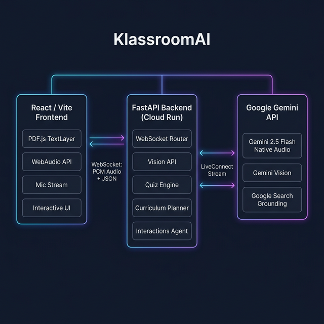
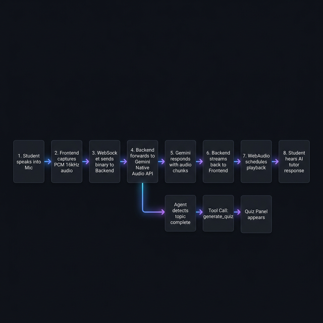

# 🎓 KlassroomAI

> **Transform static textbooks into interactive, multimodal AI learning environments.**

🔗 **Live App:** [https://klassroom-api-vav7hon2rq-uc.a.run.app](https://klassroom-api-vav7hon2rq-uc.a.run.app)
📦 **Source Code:** [github.com/inareshmatta/klassroom-ai](https://github.com/inareshmatta/klassroom-ai)

**Built with:** `Python` · `FastAPI` · `React 19` · `Vite 7` · `Gemini 2.5 Flash Native Audio` · `Gemini 3 Flash` · `Gemini Vision` · `Google Search Grounding` · `WebSockets` · `PDF.js` · `Framer Motion` · `Docker` · `Google Cloud Run`

---

## Inspiration

Modern education relies heavily on static PDFs, textbooks, and one-way lectures. When a student doesn't understand a concept, they are forced to **leave their study material** — to search Google, watch a YouTube video, or use a generic ChatGPT interface. This breaks focus and strips away the direct context of what they were studying.

We were inspired to solve this by bringing a **proactive, multimodal AI agent directly into the textbook**. Instead of the student asking the AI questions in a separate chatbox, the AI:

- 👀 **Watches** the student study (sees the exact PDF page and diagrams)
- 👂 **Listens** to their voice in real-time
- 🗣️ **Speaks back** with low-latency, natural voice tutoring
- 🧠 **Thinks** autonomously — triggering quizzes, visuals, and dictionary lookups without being asked

---

## What it does

KlassroomAI takes any uploaded textbook (PDF) and wraps it in a **multimodal AI orchestration layer**, transforming static studying into an interactive, AI-guided experience.

### 🎙️ 1. Real-time Spoken Tutor (Zero-Latency Voice)

At its core, KlassroomAI features a **voice-first proactive tutor** powered by the **Gemini 2.5 Flash Native Audio** API.

| Feature | How it works |
|---|---|
| **Natural Conversation** | Students speak naturally; the AI responds in a warm, human-like voice with <500ms latency |
| **True Barge-in** | Binary PCM audio streams via WebSockets allow instant interruption — say "Wait, explain that again" mid-sentence |
| **Contextual Awareness** | The tutor reads the current PDF page text, analyzes visible diagrams, and adapts its teaching in real-time |
| **Precise Audio Scheduling** | Uses `AudioContext.currentTime` scheduling instead of event-loop queues to eliminate stuttering and lag |

### 🤖 2. Autonomous Agentic Behaviors

The AI tutor isn't just a chatbot — it acts as an **autonomous orchestration agent** that decides when to use its tools:

| Tool | Trigger | What Happens |
|---|---|---|
| `generate_quiz` | After explaining a topic | A quiz panel slides out with MCQs, True/False, and Fill-in-the-Blank questions |
| `lookup_word` | Student encounters unfamiliar term | Google Search-grounded dictionary with IPA pronunciation, etymology, and contextual definition |
| `suggest_next_topic` | Student finishes a concept | AI guides them to the next logical topic based on curriculum and prerequisites |
| `create_bookmark` | Student highlights important text | Content is saved to the Knowledge Vault for revision |

### 🖼️ 3. Visual Explainer (Nano Banana 2)

Some concepts are impossible to understand through text or voice alone.

- If a student says *"I'm confused about the Krebs Cycle"*, the orchestration agent triggers the **Visual Explainer**
- The UI seamlessly slides out a panel that generates an **infographic, flowchart, or concept map** on the fly
- These visuals are **grounded by Google Search** results, ensuring factual accuracy over hallucination
- The student can iteratively **refine** the visual: *"Make it simpler"* or *"Add more detail about ATP"*

### 👁️ 4. Native PDF Pixel Interactivity & Vision

We discarded the traditional "upload PDF and chat" paradigm in favor of **deep DOM integration**:

- **Click any word** → instant dictionary lookup with IPA pronunciation, etymology, subject-specific definition
- **Highlight a sentence** → save it to the **Knowledge Vault** for revision sheets
- **🔖 Save** from the tooltip → pushes word + definition to your vault
- **🎨 Visualize** from the tooltip → opens the Visual Explainer pre-filled with that concept
- **👁️ Explain Page & Diagrams** → extracts a **pixel-perfect snapshot** of the current page canvas (capturing all charts, graphs, images) and sends it to the **Gemini Vision model**. The voice tutor then **verbally explains the diagram** you are looking at.

### 📅 5. Predictive AI Curriculum Planner

Students input their exam date and available daily study hours:

- AI analyzes the length and complexity of the uploaded textbook
- Dynamically generates a **personalized, week-by-week study schedule**
- Three pedagogical phases: **📖 Study → 🔄 Revision → 📝 Practice Tests**
- Progress tracking with checkable tasks and a visual progress bar
- Reset timeline capability if the student falls behind

---

## How we built it

### 🏗️ Architecture Diagram



Our system is a decoupled **React Frontend** and **FastAPI Python Backend**, orchestrated via WebSockets for real-time streaming to the Gemini API. The full stack is deployed to **Google Cloud Run**.

### 🔊 Voice Tutor Data Flow



### 🧩 Technology Stack

| Layer | Technology | Purpose |
|---|---|---|
| **Frontend** | React 19, Vite 7 | Interactive SPA with glassmorphic UI |
| **Styling** | Vanilla CSS, Framer Motion | Premium animations and transitions |
| **PDF Engine** | PDF.js (Mozilla) | Pixel-perfect TextLayer over canvas for clickable words |
| **Audio** | WebAudio API | Precise `currentTime` scheduling for zero-lag playback |
| **Backend** | Python, FastAPI | REST + WebSocket API server |
| **Voice AI** | Gemini 2.5 Flash Native Audio | Real-time bidirectional voice via LiveConnect |
| **Orchestrator** | Gemini 3 Flash Preview | Agent orchestration with tool calling |
| **Vision** | Gemini 2.5 Pro Vision | Page snapshot analysis for diagram explanation |
| **Search** | Google Search Grounding | Factual dictionary definitions and visual grounding |
| **Infra** | Docker, Cloud Run, `cloudbuild.yaml` | Automated containerized deployment |

### 📁 Folder Structure

```
KlassroomAI/
├── frontend/                      # React + Vite SPA
│   ├── src/
│   │   ├── App.jsx                # State orchestration hub
│   │   ├── index.css              # Design system tokens
│   │   └── components/
│   │       ├── CenterCanvas/      # PDF renderer, word tooltips, AI orb
│   │       ├── LeftPanel/         # Voice controls, book library, upload
│   │       ├── RightPanel/        # Knowledge vault, quiz engine
│   │       ├── VisualPanel/       # AI visual explainer overlay
│   │       ├── AssessmentPanel/   # Full assessment overlay
│   │       └── CurriculumPlanner/ # Study schedule generator
│   └── vite.config.js
│
├── backend/                       # FastAPI Python server
│   ├── main.py                    # App entry + SPA serving
│   ├── Dockerfile                 # Cloud Run container
│   ├── routers/
│   │   ├── live_session.py        # WebSocket ↔ Gemini Native Audio
│   │   ├── interactions.py        # Gemini 3 orchestrator agent
│   │   ├── vision.py              # Page analysis + dictionary
│   │   ├── visual_gen.py          # Image generation
│   │   ├── quiz.py                # Quiz generation
│   │   ├── curriculum.py          # Study plan generation
│   │   └── bookmarks.py           # Knowledge vault persistence
│   └── services/
│       └── gemini_client.py       # Shared Gemini client
│
├── cloudbuild.yaml                # GCP Infrastructure-as-Code
├── start.bat                      # One-click local launcher
└── architecture.png               # System architecture diagram
```

---

## Challenges we ran into

| Challenge | Root Cause | Our Solution |
|---|---|---|
| 🔴 **20-30s audio lag** | Recursive `onended` event-loop queuing on the main thread | Refactored to precise `AudioContext.currentTime` scheduling on the audio thread |
| 🔴 **1008 Policy Violation disconnects** | `speech_config` block unsupported by Native Audio preview models | Stripped config to minimal dict matching official Gemini Live API docs |
| 🟡 **PDF text misalignment** | Custom bounding-box detection was slow and inaccurate | Migrated to `pdf.js` native `TextLayer` for pixel-perfect DOM overlay |
| 🟡 **Barge-in trailing audio** | Old audio chunks kept playing after interruption | Added `interrupted` event handler that calls `.stop()` on all active `BufferSource` nodes |
| 🟡 **API key leaked to GitHub** | `.env` committed before `.gitignore` was in place | Google auto-revoked key; we scrubbed git history and rotated the key |

---

## Accomplishments that we're proud of

✅ Achieving a truly **human-like, zero-latency conversation loop** that understands the exact visual context of what the student is reading

✅ Successfully coupling **deep agentic tools** (autonomous quiz generation, visual explainer creation) into the real-time audio loop without blocking conversation

✅ Designing a pristine, **glassmorphic SaaS UI** that feels premium — not a hackathon prototype

✅ Building **pixel-perfect interactive PDF text** where every word is clickable for instant dictionary lookups

✅ Setting up an **automated GCP Infrastructure-as-Code pipeline** using `cloudbuild.yaml` and Cloud Run

---

## What we learned

📘 The incredible power (and difficulty) of managing **asynchronous binary WebSockets** for real-time PCM audio streaming

📘 How to orchestrate **multi-model agent handoffs** — using Gemini-3-Flash for orchestration and Native Audio for the real-time voice loop

📘 **WebAudio scheduling** is critical for smooth playback — never rely on `onended` callbacks for real-time audio

📘 Practical experience in **automated cloud deployments** via Google Cloud Run and `cloudbuild.yaml`

📘 The importance of **client-side DOM integration** with `pdf.js` TextLayers for interactive document experiences

---

## What's next for KlassroomAI

🚀 **Multi-student collaborative rooms** — multiple students join the same study session with the AI tutor moderating

🚀 **Long-term Knowledge Graphs** — storing the student's Knowledge Vault across years to predict future struggles

🚀 **Mobile Application** — porting to React Native for studying on the go

🚀 **Multi-language Support** — voice tutoring in Hindi, Spanish, and other languages

🚀 **Analytics Dashboard** — tracking study patterns, weak areas, and improvement over time

---

## 🚀 Spin-Up Instructions

### Prerequisites
- **Python 3.10+** · **Node.js 18+**

### 1. Clone & Configure
```bash
git clone https://github.com/inareshmatta/klassroom-ai.git
cd klassroom-ai
```

Create `backend/.env`:
```env
GEMINI_API_KEY=your_key_here
```

### 2. Run
**Windows** — double-click `start.bat` or:
```bash
./start.bat
```

**Manual:**
```bash
# Terminal 1: Backend
cd backend && pip install -r requirements.txt && uvicorn main:app --port 8080

# Terminal 2: Frontend
cd frontend && npm install && npm run dev
```

---

## ☁️ Cloud Deployment Proof

| Item | Link |
|---|---|
| **Live App** | [klassroom-api-vav7hon2rq-uc.a.run.app](https://klassroom-api-vav7hon2rq-uc.a.run.app) |
| **Health Check** | [/health](https://klassroom-api-vav7hon2rq-uc.a.run.app/health) |
| **Infrastructure-as-Code** | [cloudbuild.yaml](https://github.com/inareshmatta/klassroom-ai/blob/main/cloudbuild.yaml) + [Dockerfile](https://github.com/inareshmatta/klassroom-ai/blob/main/backend/Dockerfile) |
| **Cloud Console** | [Cloud Run Dashboard](https://console.cloud.google.com/run/detail/us-central1/klassroom-api?project=alert-nimbus-482707-p6) |
