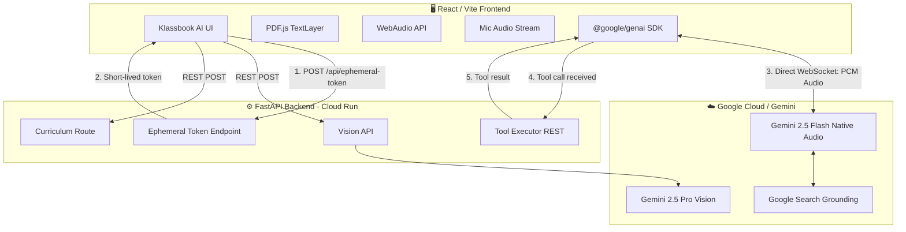
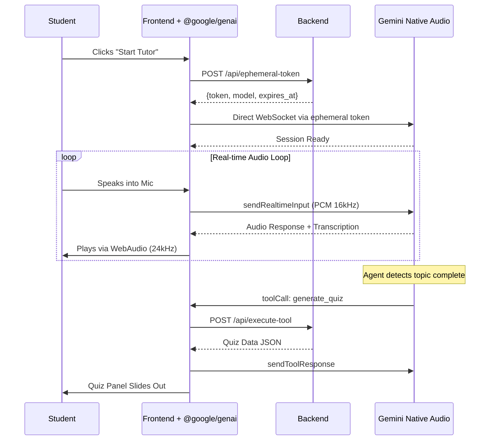

<div align="center">
  
  
  # 🎓 Klassbook AI
  
  **Transform static textbooks into interactive, multimodal AI learning environments.**

  [](https://python.org)
  [](https://fastapi.tiangolo.com)
  [](https://react.dev)
  [](https://vitejs.dev)
  [](https://ai.google.dev)
  [](https://cloud.google.com/run)
  []()
  [](https://mozilla.github.io/pdf.js/)
  [](https://www.framer.com/motion/)
  [](https://docker.com)

  <br/>

  [🌐 Live Demo](https://klassbook-ai-kygarr5jkq-uc.a.run.app) · [📖 Docs](#how-we-built-it) · [🚀 Quick Start](#-spin-up-instructions)

</div>

---

## Inspiration

Modern education relies heavily on static PDFs, textbooks, and one-way lectures. When a student doesn't understand a concept, they are forced to **leave their study material** — to search Google, watch a YouTube video, or use a generic ChatGPT interface. This breaks focus and strips away the direct context of what they were studying.

We were inspired to solve this by bringing a **proactive, multimodal AI agent directly into the textbook**. Instead of the student asking the AI questions in a separate chatbox, the AI:
- **Watches** the student study (sees the exact PDF page)
- **Listens** to their voice in real-time
- **Sees** the diagrams and charts they are looking at
- **Speaks back** with low-latency, natural voice tutoring

---

## What it does

Klassbook AI takes any uploaded textbook (PDF) and wraps it in a multimodal orchestration layer, transforming static studying into an interactive, AI-guided experience.

### 🎙️ Real-time Spoken Tutor (Zero-Latency Voice)
At its core, Klassbook AI features a **voice-first proactive tutor** powered by the **Gemini 2.5 Flash Native Audio** API.

| Feature | How it works |
|---|---|
| **Natural Conversation** | Students speak naturally; the AI responds in a warm, human-like voice with <500ms latency |
| **Direct Client-to-Server** | Browser connects directly to Gemini Live API via ephemeral tokens — no backend proxy, no double-hop |
| **True Barge-in** | Server-side VAD detects interruptions instantly — say "Wait, explain that again" mid-sentence |
| **Contextual Awareness** | The tutor reads the current PDF page text, analyzes visible diagrams, and adapts its teaching in real-time |
| **Secure by Design** | API key never leaves the backend — frontend uses short-lived, single-use ephemeral tokens |

### 🤖 Autonomous Agentic Behaviors
The AI tutor isn't just a chatbot — it acts as an **autonomous orchestration agent** that decides when to use its tools. When a tool is triggered, the corresponding **UI panel auto-opens instantly** with the generated content pre-loaded — the student never has to manually navigate anywhere.

| Tool | Trigger | What Happens |
|---|---|---|
| `generate_quiz` | After explaining a topic | **Assessment Panel auto-opens** with pre-loaded MCQs, True/False, and Fill-in-the-Blank questions — quiz starts immediately |
| `lookup_word` | Student encounters an unfamiliar term | Google Search-grounded dictionary with IPA pronunciation, etymology, and contextual definition |
| `generate_visual` | Concept needs a picture | **Visual Canvas auto-opens** with the generated infographic, flowchart, or concept map displayed instantly |
| `suggest_next_topic` | Student finishes a concept | AI guides them to the next logical topic based on curriculum and prerequisites |
| `create_bookmark` | Student highlights important text | Content is saved to the Knowledge Vault for revision |
| `summarize_page` | Page is dense or overwhelming | Generates concise bullet-point summaries of the current textbook page |
| `explain_like_im_5` | Student says "I still don't get it" | Simplifies concept with everyday analogies a child could understand |
| `compare_concepts` | Student confuses two similar terms | Side-by-side comparison showing similarities, differences, and a summary |
| `generate_flashcards` | Student finishes a chapter | Creates front/back revision flashcards for spaced repetition study |

> **Smart Tool Responses:** Tool results are split into two streams — the full rich data (quiz JSON, image bytes) goes to the frontend UI, while a lightweight status message goes back to the voice model. This prevents the AI from verbally reading out quiz questions or image descriptions, keeping the conversation natural.

### 🖼️ Visual Explainer (Nano Banana 2)
Some concepts are impossible to understand through text or voice alone.

- If a student says *"I'm confused about the Krebs Cycle"*, the orchestration agent triggers the **Visual Explainer**
- The UI seamlessly slides out a panel that generates an **infographic, flowchart, or concept map** on the fly
- These visuals are **grounded by Google Search** results, ensuring factual accuracy over hallucination
- The student can iteratively **refine** the visual: *"Make it simpler"* or *"Add more detail about ATP"*

### 👁️ Native PDF Pixel Interactivity & Vision
We discarded the traditional "upload PDF and chat" paradigm in favor of **deep DOM integration**:

- **Clickable Words**: By rendering a precise HTML `TextLayer` over the PDF Canvas using `pdf.js`, every single word in the book becomes interactive
- **Click → Dictionary**: Instant lookup with IPA pronunciation, etymology, subject-specific and general definitions
- **Highlight → Bookmark**: Select a sentence to save it to the **Knowledge Vault** for revision sheets
- **🔖 Save to Vault**: From the dictionary tooltip, one click saves the word and definition
- **🎨 Visualize**: From the dictionary tooltip, one click opens the Visual Explainer pre-filled with that concept
- **👁️ Explain Page & Diagrams**: A single button extracts a **pixel-perfect Base64 snapshot** of the current page's canvas (capturing complex charts, graphs, and images) and sends it directly to the **Gemini Vision model**. The voice tutor then verbally explains the specific diagram

### 📅 Predictive AI Curriculum Planner
Students input their exam date and available daily study hours:

- The system analyzes the length and complexity of the uploaded textbook
- The AI dynamically generates a **personalized, week-by-week study schedule**
- Three distinct pedagogical phases: **📖 Study** → **🔄 Revision** → **📝 Practice Tests**
- **Progress tracking** with checkable tasks and a visual progress bar
- **Reset timeline** capability if the student falls behind

---

## How we built it

Our system is a decoupled **React Frontend** and **FastAPI Python Backend**. The voice tutor uses Google's recommended **client-to-server** architecture — the browser connects **directly** to the Gemini Live API via short-lived ephemeral tokens, eliminating the backend WebSocket proxy for minimal latency. Tool execution stays server-side via REST endpoints.

### System Architecture



### Data Flow: Voice Tutor Session



### Folder Structure

```
Klassbook AI/
├── 📁 frontend/                    # React + Vite SPA
│   ├── src/
│   │   ├── App.jsx                 # State orchestration hub
│   │   ├── index.css               # Design system tokens
│   │   └── components/
│   │       ├── CenterCanvas/       # PDF renderer, word tooltips, AI orb
│   │       ├── LeftPanel/          # Voice controls, book library, upload
│   │       ├── RightPanel/         # Knowledge vault, quiz engine
│   │       ├── VisualPanel/        # AI visual explainer overlay
│   │       ├── AssessmentPanel/    # Full assessment overlay
│   │       └── CurriculumPlanner/  # Study schedule generator
│   └── vite.config.js              # Dev proxy to backend
│
├── 📁 backend/                     # FastAPI Python server
│   ├── main.py                     # App entry + SPA serving
│   ├── Dockerfile                  # Cloud Run container
│   ├── requirements.txt
│   ├── services/
│   │   └── gemini_client.py        # Shared Gemini client
│   └── routers/
│       ├── ephemeral_token.py     # Mints short-lived tokens for Live API
│       ├── tool_executor.py       # REST endpoint for tool execution
│       ├── live_session.py        # Legacy WebSocket proxy (kept as fallback)
│       ├── interactions.py         # Gemini 3 orchestrator agent
│       ├── vision.py               # Page analysis + dictionary
│       ├── visual_gen.py           # Image generation
│       ├── quiz.py                 # Quiz generation
│       ├── curriculum.py           # Study plan generation
│       ├── upload.py               # PDF upload handling
│       └── bookmarks.py            # Knowledge vault persistence
│
├── cloudbuild.yaml                 # GCP Infrastructure-as-Code
├── start.bat                       # One-click local launcher
└── architecture.png                # System architecture diagram
```

---

## Challenges we ran into

| Challenge | Root Cause | Our Solution |
|---|---|---|
| **Overengineered proxy** | Server-to-server WebSocket relay added latency + complexity + per-turn receive loop bug | Migrated to Google's recommended **client-to-server** architecture with ephemeral tokens |
| **API key security** | Direct client connection risks exposing API key | Backend mints single-use, 1-min ephemeral tokens via `auth_tokens.create()` |
| **20-30s audio lag** | Recursive `onended` event-loop queuing on main thread | Refactored to precise `AudioContext.currentTime` scheduling at 24kHz |
| **PDF text misalignment** | Custom bounding-box detection was slow and inaccurate | Migrated to `pdf.js` native `TextLayer` for pixel-perfect DOM overlay |
| **Tool calls in direct mode** | Tools need backend API key for Gemini calls | Frontend receives tool calls, POSTs to `/api/execute-tool`, sends results back to Gemini |
| **Infinite tool-call loop** | Sending full quiz/image JSON back to voice model caused it to re-trigger tools or read data aloud | Split data streams: rich payload → UI, lightweight status → voice model. Reduced audio `timeSlice` from 1s to 250ms for faster input streaming |

---

## Accomplishments that we're proud of

- 🎙️ Achieving a truly **human-like, zero-latency conversation loop** that understands the exact visual context of what the student is reading
- 🤖 Successfully coupling **deep agentic tools** (autonomous quiz generation, visual explainer) into the real-time audio loop without blocking conversation
- 🔗 **Seamless tool-to-UI integration** — when the voice agent triggers a quiz or visual, the correct panel auto-opens with data pre-loaded. No manual navigation required.
- ✨ Designing a pristine, **glassmorphic SaaS UI** that feels premium — not a hackathon prototype
- ☁️ Setting up an **automated GCP Infrastructure-as-Code pipeline** using `cloudbuild.yaml` and Cloud Run
- 📄 Building **pixel-perfect interactive PDF text** where every word is clickable for instant dictionary lookups

---

## What we learned

- The **client-to-server** pattern with ephemeral tokens is both simpler and faster than backend WebSocket proxying
- How to orchestrate **multi-model agent handoffs** — using Gemini-3-Flash for orchestration and Native Audio for the real-time voice loop
- **WebAudio scheduling** is critical for smooth playback — never rely on `onended` callbacks for real-time audio
- Practical experience in **automated cloud deployments** via Google Cloud Run and `cloudbuild.yaml`
- The importance of **client-side DOM integration** with `pdf.js` TextLayers for interactive document experiences

---

## What's next for Klassbook AI

- 👥 **Multi-student collaborative rooms** — multiple students join the same study session with the AI tutor moderating
- 🧠 **Long-term Knowledge Graphs** — storing the student's Knowledge Vault across years to predict future struggles
- 📱 **Mobile Application** — porting to React Native for studying on the go
- 🌍 **Multi-language Support** — voice tutoring in Hindi, Spanish, and other languages
- 📊 **Analytics Dashboard** — tracking study patterns, weak areas, and improvement over time

---

## 🚀 Spin-Up Instructions

### Prerequisites
- **Python 3.10+**
- **Node.js 18+**

### 1. Clone & Configure
```bash
git clone https://github.com/inareshmatta/klassroom-ai.git
cd klassroom-ai
```

Create `backend/.env`:
```env
GEMINI_API_KEY=your_key_here
```

### 2. Run
**Windows** — double-click `start.bat` or run:
```bash
./start.bat
```

**Manual:**
```bash
# Terminal 1: Backend
cd backend
pip install -r requirements.txt
uvicorn main:app --port 8080

# Terminal 2: Frontend
cd frontend
npm install
npm run dev
```

---

## 🧪 Reproducible Testing Instructions

After spinning up the app, here's how judges can test every feature:

### Test 1: Upload a PDF & Interactive Words
1. Open [https://klassbook-ai-kygarr5jkq-uc.a.run.app](https://klassbook-ai-kygarr5jkq-uc.a.run.app) in Chrome
2. Drag any PDF into the upload area on the left panel
3. **Click any word** on the rendered page → a dictionary tooltip appears with pronunciation, etymology, and definition
4. Click **🔖 Save** → the word appears in the **Knowledge Vault** (right panel)
5. **Highlight a multi-word phrase** → the same tooltip appears for the entire selection

### Test 2: Voice Tutor (Real-time Conversation)
1. With a PDF loaded, click **🎙 Start Tutor** in the left panel
2. Allow microphone access when prompted
3. **Speak**: *"Can you explain what's on this page?"*
4. The AI should respond **within 1-2 seconds** with spoken audio
5. **Test barge-in**: while the AI is speaking, interrupt — it should stop and respond to your interruption

### Test 3: Visual Explainer
1. Click any word on the PDF → dictionary tooltip appears
2. Click **🎨 Visualize** → the Visual Explainer panel opens with the word pre-filled
3. Click **Generate** → an AI-generated visual should appear

### Test 4: Explain Page & Diagrams (Vision)
1. Navigate to a page with diagrams/charts in the PDF
2. Click **👁️ Explain Page & Diagrams** button
3. The AI should verbally describe the visual content on the page

### Test 5: Curriculum Planner
1. Click **📅 Study Planner** in the left panel
2. Set an exam date and daily study hours → click **Generate Plan**
3. A week-by-week schedule appears; check off tasks to track progress

### Test 6: Cloud Deployment
1. Visit [https://klassbook-ai-kygarr5jkq-uc.a.run.app/health](https://klassbook-ai-kygarr5jkq-uc.a.run.app/health) → Expected: `{"status":"ok","service":"Klassbook AI"}`
2. Visit [https://klassbook-ai-kygarr5jkq-uc.a.run.app](https://klassbook-ai-kygarr5jkq-uc.a.run.app) → Full app served from Cloud Run

---

## ☁️ Cloud Deployment Proof

| Item | Link |
|---|---|
| **Live App** | [https://klassbook-ai-kygarr5jkq-uc.a.run.app](https://klassbook-ai-kygarr5jkq-uc.a.run.app) |
| **Health Check** | [/health](https://klassbook-ai-kygarr5jkq-uc.a.run.app/health) |
| **Infrastructure-as-Code** | [`cloudbuild.yaml`](./cloudbuild.yaml) + [`Dockerfile`](./backend/Dockerfile) |
| **Google Cloud API Usage** | [`ephemeral_token.py`](https://github.com/inareshmatta/klassroom-ai/blob/main/backend/routers/ephemeral_token.py) — Ephemeral token minting · [`tool_executor.py`](https://github.com/inareshmatta/klassroom-ai/blob/main/backend/routers/tool_executor.py) — Tool execution · [`VoiceControls.jsx`](https://github.com/inareshmatta/klassroom-ai/blob/main/frontend/src/components/LeftPanel/VoiceControls.jsx) — Direct Gemini Live API connection · [`interactions.py`](https://github.com/inareshmatta/klassroom-ai/blob/main/backend/routers/interactions.py) — Agentic tool orchestration |
| **Cloud Console** | [Cloud Run Dashboard](https://console.cloud.google.com/run/detail/us-central1/klassroom-api?project=alert-nimbus-482707-p6) |

---

<div align="center">
  <p>Built with ❤️ for the Google AI Agent Hackathon</p>
</div>
